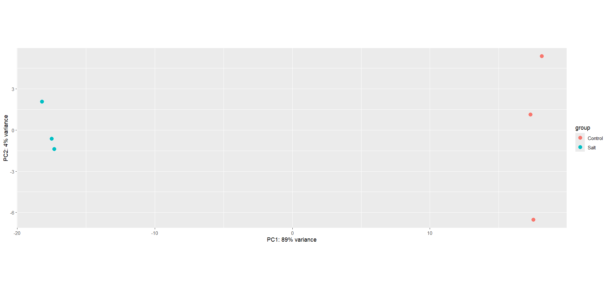
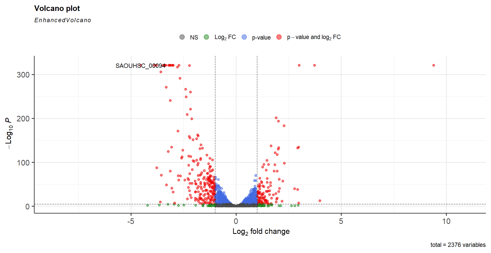
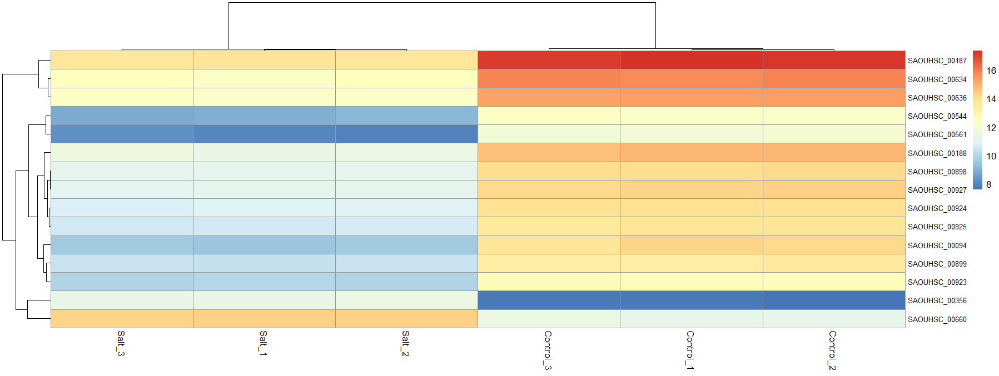
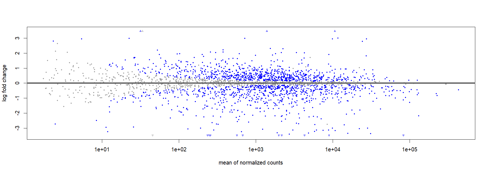

# RNA-Seq Analysis of Salt Stress Response in Staphylococcus aureus (GSE250540)


## Overview

This repository contains a bulk RNA-seq analysis of the transcriptional response
of *Staphylococcus aureus* SG511 to high-salt stress. Publicly available
single-end RNA-seq reads from GEO series
[GSE250540](https://www.ncbi.nlm.nih.gov/geo/query/acc.cgi?acc=GSE250540)
were processed from raw SRA files through quality control, read trimming,
alignment, gene-level counting, differential expression analysis, and
functional annotation.

The comparison is:

- **Salt stress:** growth in LB medium containing 1 M NaCl
- **Control:** growth in LB medium without added NaCl
- **Replication:** three biological replicates per condition

The supplied DESeq2 analysis identifies **357 differentially expressed
features**, including **127 upregulated** and **230 downregulated** features,
using `padj < 0.05` and `abs(log2FoldChange) > 1`.

## Biological Background

High extracellular salt lowers water activity and creates osmotic stress.
*S. aureus* can respond by changing membrane transport, compatible-solute
metabolism, cell-envelope processes, central metabolism, and expression of
stress-associated proteins. RNA-seq provides a genome-wide view of these
changes by comparing transcript abundance between salt-treated and untreated
cells.

This analysis highlights increased expression of genes associated with
choline/glycine-betaine metabolism and transport, together with extensive
downregulation of transport, fermentation, amino-acid biosynthesis, and
surface-associated functions. These patterns support broad metabolic and
cell-envelope remodeling under 1 M NaCl.

## Dataset

| Analysis label | GEO sample | SRA run | Condition | Biological replicate |
|---|---|---|---|---:|
| `Salt_1` | GSM7981333 | SRR27291863 | 1 M NaCl | 3 |
| `Salt_2` | GSM7981332 | SRR27291864 | 1 M NaCl | 2 |
| `Salt_3` | GSM7981331 | SRR27291865 | 1 M NaCl | 1 |
| `Control_1` | GSM7981330 | SRR27291866 | Untreated | 3 |
| `Control_2` | GSM7981329 | SRR27291867 | Untreated | 2 |
| `Control_3` | GSM7981328 | SRR27291868 | Untreated | 1 |

The `Salt_1` to `Salt_3` and `Control_1` to `Control_3` labels follow the
column order used in `DEG.R`; their numeric suffixes do not correspond to the
original biological-replicate numbers.

Additional metadata are available in
[`data/metadata/sample_metadata.csv`](data/metadata/sample_metadata.csv).


1. Download six single-end SRA runs with `prefetch` and `fasterq-dump`.
2. Assess raw-read quality with FastQC and summarize reports with MultiQC.
3. Trim low-quality trailing bases with Trimmomatic (`TRAILING:10`).
4. Repeat FastQC and MultiQC after trimming.
5. Download the `GCF_000013425.1` genome and annotation.
6. Build a HISAT2 index and align each trimmed read set.
7. Sort and index BAM files with SAMtools.
8. Count reads per annotated feature with featureCounts.
9. Remove features with 10 or fewer total counts.
10. Fit the DESeq2 model `~ condition`.
11. Define DEGs using `padj < 0.05` and `abs(log2FoldChange) > 1`.
12. Annotate locus tags with gene and product information from the NCBI GFF.

## Repository Structure

```text
.
|-- README.md
|-- environment.yml
|-- .gitignore
|-- figures/
|   |-- heatmap.png
|   |-- ma_plot.png
|   |-- pca.png
|   `-- volcano_plot.png
|-- results/
|   `-- differential_expression/
|       |-- README.md
|       |-- DESeq2_results.csv
|       `-- SaltStress_Annotated_DEGs.csv
|    `-- output_reference.md
`-- scripts/
    |-- DEG.R
    `-- GSE250540_RNAseq_pipeline.sh
    `-- sample_metadata.csv
```

Large raw FASTQ, reference, and BAM files are not tracked. They can be
regenerated with the preprocessing script.


## Scripts

### `scripts/GSE250540_RNAseq_pipeline.sh`

Runs the command-line workflow from SRA download through featureCounts. It
creates directories for raw reads, trimmed reads, QC reports, alignments,
counts, references, logs, and scripts.

Important assumptions:

- The original script uses a hard-coded working directory.
- Trimmomatic is called through a hard-coded JAR path.
- The featureCounts output is named `counts/featurecounts.txt`, whereas
  `DEG.R` reads `gene_counts.txt`. Copy or rename this file before running R,
  or update the R input path.
- The script uses the NCTC 8325 reference assembly `GCF_000013425.1`.

### `scripts/DEG.R`

Imports featureCounts output, assigns the six sample conditions, filters
low-count features, runs DESeq2, exports result tables, produces PCA,
volcano, heatmap, and MA plots, and merges results with an NCBI GFF
annotation using locus tags.

The final standalone `clusterProfiler` line is an unfinished interactive
command and can be removed or replaced before running the script
non-interactively.

## Key Results

| Result | Count |
|---|---:|
| Features tested | 2,376 |
| Features with non-missing adjusted p-values | 2,372 |
| Significant DEGs | 357 |
| Upregulated under salt stress | 127 |
| Downregulated under salt stress | 230 |
| Significant entries annotated as hypothetical proteins | 177 |

Selected strongly regulated features include:

| Locus tag | Product | log2 fold change | Interpretation |
|---|---|---:|---|
| `SAOUHSC_02333` | Transglycosylase SceD | 9.40 | Strong cell-envelope remodeling response |
| `SAOUHSC_02937` | Choline transporter | 2.94 | Increased uptake of an osmoprotectant precursor |
| `SAOUHSC_02933` | Betaine aldehyde dehydrogenase | 2.93 | Compatible-solute biosynthesis |
| `SAOUHSC_02932` | Choline dehydrogenase | 2.78 | Choline-to-betaine pathway activation |
| `SAOUHSC_00075` | SbnA | 2.98 | Altered siderophore/iron-associated metabolism |
| `SAOUHSC_00187` | Formate acetyltransferase | -3.48 | Reduced pyruvate-formate fermentation activity |
| `SAOUHSC_00188` | Pyruvate formate-lyase activating enzyme | -3.34 | Coordinated reduction of anaerobic metabolism |
| `SAOUHSC_00898` | Argininosuccinate lyase | -2.99 | Reduced arginine biosynthetic expression |
| `SAOUHSC_00899` | Argininosuccinate synthase | -3.12 | Reduced arginine biosynthetic expression |
| `SAOUHSC_00544` | Fibrinogen-binding protein SdrC | -3.39 | Reduced expression of a surface-associated factor |

Several adjusted p-values are stored as `0` because extremely small values
underflowed during numerical output; this does not mean that the true
probability is exactly zero.

### Biological Interpretation

The clearest salt-associated signal is activation of the choline-to-betaine
system. Choline transport, choline dehydrogenase, and betaine aldehyde
dehydrogenase are all strongly upregulated. Glycine betaine is a compatible
solute that helps cells retain water and protect macromolecules during
osmotic stress.

The very large increase in SceD expression suggests substantial
reorganization of the cell wall or envelope. At the same time, coordinated
decreases in pyruvate formate-lyase genes, arginine biosynthesis genes, and
multiple ABC transport systems indicate broad redistribution of metabolic
resources. Downregulation of SdrC suggests that salt stress also affects
surface-associated or host-interaction functions.

Interpretation should remain cautious because 177 significant entries are
annotated only as hypothetical proteins, most entries lack a conventional
gene symbol, and the analysis uses a reference strain different from the
experimental strain.

## Figures

### PCA



PC1 explains **89%** of the variance and cleanly separates salt-treated from
control samples. PC2 explains **4%** and mainly reflects variation within
conditions. The strong PC1 separation indicates that salt treatment is the
dominant source of transcriptome-wide variation.

### Volcano Plot



The x-axis shows log2 fold change and the y-axis shows `-log10(padj)`.
Positive values indicate higher expression under salt stress, and negative
values indicate lower expression. SceD (`SAOUHSC_02333`) is the strongest
positive outlier, while numerous genes show large negative changes.

`EnhancedVolcano` was run with its default cutoffs, so the colors in this
saved plot use a stricter default adjusted-p-value threshold than the
`padj < 0.05` threshold used to export the DEG table.

### Heatmap



The heatmap displays variance-stabilized expression for the 15 genes with
the smallest adjusted p-values. Samples cluster by treatment, supporting the
PCA result. Most displayed genes are lower in salt-treated samples, while a
smaller group shows strong salt-associated induction.

The heatmap uses unscaled variance-stabilized values (`scale = "none"` by
default), so colors represent expression magnitude rather than row-wise
z-scores.

### MA Plot



The MA plot compares mean normalized expression with log2 fold change. Most
features center near zero, while regulated genes extend in both directions.
Triangles mark points outside the displayed y-axis range. DESeq2's default
`plotMA()` significance level is `alpha = 0.1`, so blue points do not exactly
match the repository's final DEG threshold.

## Output Files

The two tracked differential-expression tables are:

- `DESeq2_results.csv`: all 2,376 tested features with abundance, effect-size,
  standard-error, test-statistic, p-value, and adjusted-p-value columns.
- `SaltStress_Annotated_DEGs.csv`: the 357 significant features, joined to
  locus-tag, gene-symbol, and product annotations.

See [`docs/output_reference.md`](docs/output_reference.md) for a complete
description of generated folders and intermediate files.

## Software and Dependencies

| Stage | Software or package | Purpose |
|---|---|---|
| Data download | SRA Toolkit | `prefetch` and `fasterq-dump` |
| Quality control | FastQC | Per-sample read-quality reports |
| QC aggregation | MultiQC | Combined quality-control reports |
| Trimming | Trimmomatic 0.39 | Removal of low-quality trailing bases |
| Alignment | HISAT2 | Read alignment |
| BAM processing | SAMtools | BAM sorting and indexing |
| Quantification | Subread featureCounts | Gene-level read counts |
| Statistical analysis | R and DESeq2 | Normalization and differential expression |
| Data handling | tidyverse | Table manipulation |
| Annotation | rtracklayer | GFF import |
| Volcano plot | EnhancedVolcano | Effect-size/significance visualization |
| Heatmap | pheatmap | Clustered expression heatmap |

## Data Availability

- GEO series: [GSE250540](https://www.ncbi.nlm.nih.gov/geo/query/acc.cgi?acc=GSE250540)
- BioProject: [PRJNA1054505](https://www.ncbi.nlm.nih.gov/bioproject/PRJNA1054505)
- Reference used by this repository:
  [GCF_000013425.1](https://www.ncbi.nlm.nih.gov/datasets/genome/GCF_000013425.1/)
